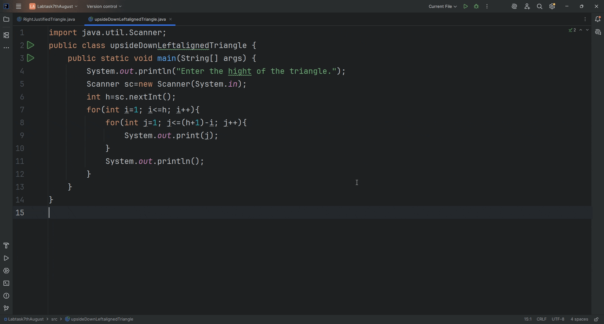

# Inverted Left-Aligned Number Triangle

A simple Java console application that prints an **inverted left-aligned triangle** of numbers.  
The triangle starts with a full row of numbers from `1` to `n` and reduces the count by one each line until only `1` is printed.

---

## 📜 Problem Statement

Write a Java program to:
1. Accept an integer `n` as the height of the triangle.
2. Print rows of numbers starting from `1` to a decreasing maximum each row.
3. Align the numbers to the left.

---

###🎥 Demo Output



*This simple Java program prints a Inverted Left-Aligned Number Triangle of numbers.*
#### 🚀 How to Run

1. **Clone this repository**
   ```bash
   git clone https://github.com/YOUR_USERNAME/InvertedLeftAlignedNumberTriangle.git
   cd InvertedLeftAlignedNumberTriangle
  
 1. Compile the Java file


javac InvertedLeftAlignedNumberTriangle.java

2. Run the program

java InvertedLeftAlignedNumberTriangle

🛠 Technologies Used
Java SE (Standard Edition)

